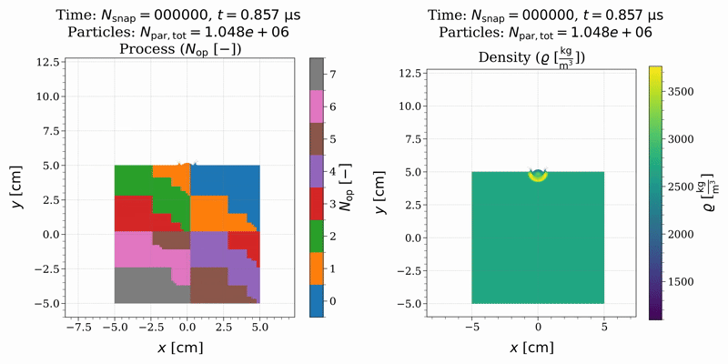

<!-- 

<h1>Christian Jetter</h1>

M.Sc. in <strong>Physics</strong> with a specialization in <strong>Computational Physics</strong> and
<strong>Scientific Software Development</strong>, completed at the
<a href="https://uni-tuebingen.de/fakultaeten/mathematisch-naturwissenschaftliche-fakultaet/fachbereiche/physik/institute/astronomie-und-astrophysik/computational-physics/willkommen/">
University of Tübingen.

  
  
  

---

<h4>Languages & Tools</h4>

  
  
  
  
  
  

<h4>Other Languages</h4>

  
  
  

<h4>Operating Systems</h4>

  
  
  
  

<h4>Databases</h4>

  
  

<h4>IDE</h4>

  
  
  
  
  

<h4>Additional Tools</h4>

  
  
  
  
  

<h4>Learning</h4>

  
  

---

<h3>Projects</h3>

<h4>MilupHPC</h4>

<table>
  <tr>
    <td valign="top" width="500">
      <ul>
        <li><a href="https://christophmschaefer.github.io/milupHPC/">milupHPC API documentation</a></li>
        <li>HPC N-Body and Smoothed Particle Hydrodynamics (SPH) code using CUDA-aware MPI for distributed systems</li>
        <li>Supports 1D, 2D, and 3D simulations</li>
        <li>Dynamic load balancing via space-filling curves</li>
        <li>Current test cases:
          <ul>
            <li>Plummer model</li>
            <li>Taylor–von Neumann–Sedov blast wave</li>
            <li>Isothermal collapse of a molecular cloud (Boss & Bodenheimer)</li>
            <li>Elastic rings</li>
            <li>Plastic deformation von Mises criterion</li>
          </ul>
        </li>
      </ul>
      
    </td>
    <td align="center" width="500">
        
    </td>
</table> -->

<h1>Christian Jetter</h1>

M.Sc. in Physics with a specialization in Computational Physics and Scientific Software Development, completed at the
<a href="https://uni-tuebingen.de/fakultaeten/mathematisch-naturwissenschaftliche-fakultaet/fachbereiche/physik/institute/astronomie-und-astrophysik/computational-physics/willkommen/">
University of Tübingen
</a>.

Focused on C++ software development, numerical simulation, high-performance computing, and scientific data analysis.

  
  
  

---

## Core Expertise

- Scientific software development in C++ and Python
- Numerical simulation of physical systems
- High-performance computing (HPC, CUDA, MPI)
- Data analysis and scientific visualization
- Physics-based modeling and algorithm development

---

## Technologies

#### Programming Languages

  
  
  
  
  

### Development Tools & Environment

  
  
  
  
    
  
  
  

#### Python & Scientific Computing Stack

  
  
  

  
  
  
  
  
  

<!-- #### HPC & Data Processing

  
  
  
  
  
   

 -->

#### IDEs & Development Environments

  
  
  
  <!--  -->
  
  
  

---

## Selected Project

### MilupHPC — High-Performance Simulation Framework

<table>
<tr>
<td width="55%" valign="top">

- High-performance N-body and Smoothed Particle Hydrodynamics (SPH) simulation framework  
- Implemented in modern C++ with CUDA-aware MPI for distributed systems  
- Scalable from single GPU systems to HPC clusters  
- Supports one-, two- and three-dimensional simulations  
- Dynamic load balancing using space-filling curve methods  
- Focus on performance, numerical stability, and scalability  

Applications include:
- Plummer model
- Taylor–von Neumann–Sedov blast wave
- Isothermal collapse of a molecular cloud (Boss & Bodenheimer)
- Elastic rings
- Plastic deformation (von Mises criterion)

</td>

<td width="45%" align="center">
  
</td>
</tr>
</table>
